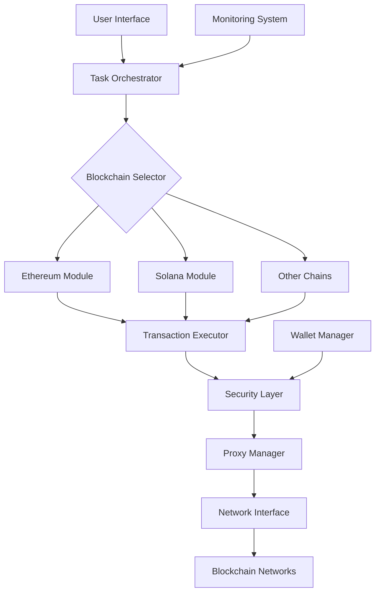

# Layer Airdrop OG

  
  
  <h3>Enterprise-Grade Blockchain Automation & Airdrop Management</h3>
  
  
  
  
  
  

## 📊 Project Overview

Layer Airdrop OG is a comprehensive suite of automation tools designed to streamline blockchain interactions, airdrop management, and reward distribution. Our platform provides enterprise-grade solutions for blockchain projects and individual users looking to optimize their participation in the decentralized economy.

### Why Choose Layer Airdrop OG?

- **Multi-Chain Support**: Tools that work across Ethereum, Solana, Base, Zora, Sepolia, and numerous testnets
- **Secure Architecture**: Advanced proxy rotation and wallet management with security-first design
- **Resource Efficiency**: Optimized automation that minimizes gas costs and maximizes rewards
- **Community-Driven**: Continuously developed based on real user feedback and blockchain evolution

## 🔍 Architecture

## 🛠️ Tools & Capabilities

Our GitHub organization hosts specialized automation tools designed to maximize blockchain interaction efficiency:

### Airdrop Automation Suite

| Tool Name | Purpose | Features |
|-----------|---------|----------|
| **Billions-BOT** | Automated claiming on Billions Network | • Multi-wallet management • Scheduled claiming • Advanced proxy support |
| **Solix-Auto-BOT** | Task automation for Solix DePIN | • Task verification • Auto-rewards claiming • Performance analytics |
| **Seismic-Deploy-BOT** | Operations on Seismic Testnet | • Smart contract deployment • Gas optimization • Cross-chain bridging |
| **GpuNet-BOT** | GPU net token & referral management | • Referral tracking • Token management • Reward optimization |

### Verification & Analytics Tools

| Tool Name | Purpose | Features |
|-----------|---------|----------|
| **Zora-Checker** | Token allocation verification on ZORA | • Multi-address checking • Historical snapshots • Eligibility predictions |
| **ByteNova-Daily-BOT** | Daily check-ins for ByteNova | • Scheduled automation • Task verification • Reward tracking |
| **Coresky-BOT** | Complete platform automation | • Check-in automation • Ticket minting • Spin wheel optimization |

### Cross-Chain Interaction Tools

| Tool Name | Purpose | Features |
|-----------|---------|----------|
| **r2-bot** | USDC/R2USD/sR2USD token management | • Cross-chain transfers • Swap automation • Token bridging |
| **Stork** | Stork Oracle Network verification | • Oracle data verification • Network monitoring • Reliability analytics |
| **Puzzle-mania-bot** | 0G Puzzle Mania platform automation | • Multi-account management • Daily task completion • Reward optimization |

## 🤝 Community & Support

Layer Airdrop OG thrives on community collaboration and shared knowledge. Join us to:

- Discover emerging airdrop opportunities
- Get technical support for tool implementation
- Share strategies and insights
- Contribute to open-source development

### Connect With Us

- 💬 [Telegram Community](https://t.me/layerairdrop)
- 🗣️ [Discussion Group](https://t.me/layerairdropdiskusi)
- 🤖 [Discord Server](https://discord.gg/layerairdrop)
- 📱 [Twitter/X](https://twitter.com/layerairdrop)

## 👥 Contributing

We welcome contributions from developers of all skill levels! Here's how to get involved:

1. Fork the repository you'd like to improve
2. Create a feature branch: `git checkout -b feature/amazing-improvement`
3. Commit your changes: `git commit -m 'Add amazing feature'`
4. Push to your branch: `git push origin feature/amazing-improvement`
5. Submit a pull request

For more details, check our [Contribution Guidelines](https://github.com/layerairdrop/docs/CONTRIBUTING.md).

## ⚠️ Security Notice

Blockchain interaction tools carry inherent risks. We strongly advise:

- **Separate wallets**: Never use your main wallet for airdrop farming
- **Code review**: Always review scripts before execution
- **Private key security**: Never share private keys or seed phrases
- **Terms compliance**: Follow the terms of service for all platforms
- **Risk management**: Only use funds you can afford to lose

## 📜 License

All our tools are open source under the MIT License. See the [LICENSE](LICENSE) file for details.

---

  
Building the future of blockchain automation, one tool at a time.

  
Happy Hunting! 🎯

